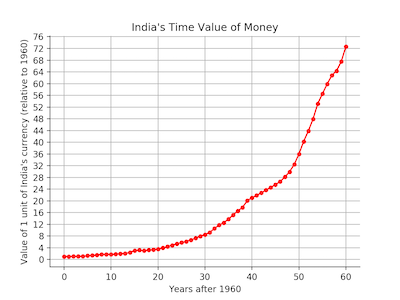

# Time Value of Money Tools
## Prabhav Kumar | 10th July 2020

### This project allows you to: 1) Visualise the value of a currency over a period of time 2) Calculate the time value of money in a particular region (country,continent, etc.) at a given time, relative to a base year. 

#### 1) The user inputs a "Region" (R). The output is a graph that displays how the value 1 unit of R's currency has changed over a period of time.
##### Example: if R = India, the output is: 

#### 2) The user inputs a "Region" (R), a "Start Year" (SY), and a "End Year" (EY). Then using World Bank data, the calculator uses CPI as a discount rate to determine and output how many units of the currency in the "End Year" is equivalent to 1 unit of the currency in the "Start Year". 
##### Example: if the R = India, SY = 1970, EY = 2020, the output is "1U in 1970 is worth 41.24U in 2020, where U represents India's currency".

###### Dataset: https://data.worldbank.org/indicator/FP.CPI.TOTL.ZG
